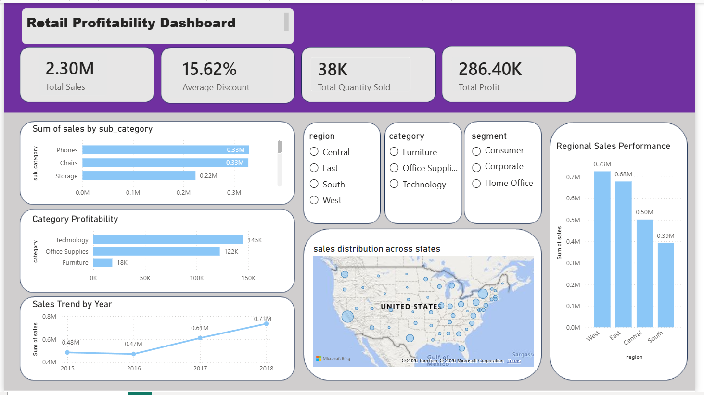

# Revenue-Leakage-Profitability-Analysis

## Dashboard Preview

## Project Overview

This project analyzes retail sales data to identify revenue leakage, profitability trends, and discount impact using MySQL and Power BI.

The goal was to uncover loss-making products, evaluate regional performance, and generate business recommendations for improving profitability.

---

## Tools Used

- MySQL
- Power BI
- Excel

---

## Dataset

- Superstore Retail Dataset
- 9,994 Orders
- Multiple Regions
- Product Categories and Sub-Categories

---

## Key Business Questions

1. Which categories generate the highest profit?
2. Which sub-categories cause losses?
3. How do discounts affect profitability?
4. Which regions perform best?
5. What are the major sources of revenue leakage?

---

## Key Insights

- Technology generated the highest profit.
- Tables and Bookcases were loss-making sub-categories.
- West region achieved the strongest sales performance.
- Higher discounts significantly reduced profitability.

---

## Dashboard Features

- KPI Cards
- Category Profitability Analysis
- Regional Sales Analysis
- Top 10 Sub-Categories by Sales
- Geographic Sales Distribution
- Yearly Sales Trend Analysis
- Interactive Slicers

---

## Business Recommendations

- Reduce excessive discounting on low-margin products.
- Re-evaluate pricing strategy for Tables and Bookcases.
- Focus marketing efforts on high-profit categories.
- Expand successful strategies used in the West region.
